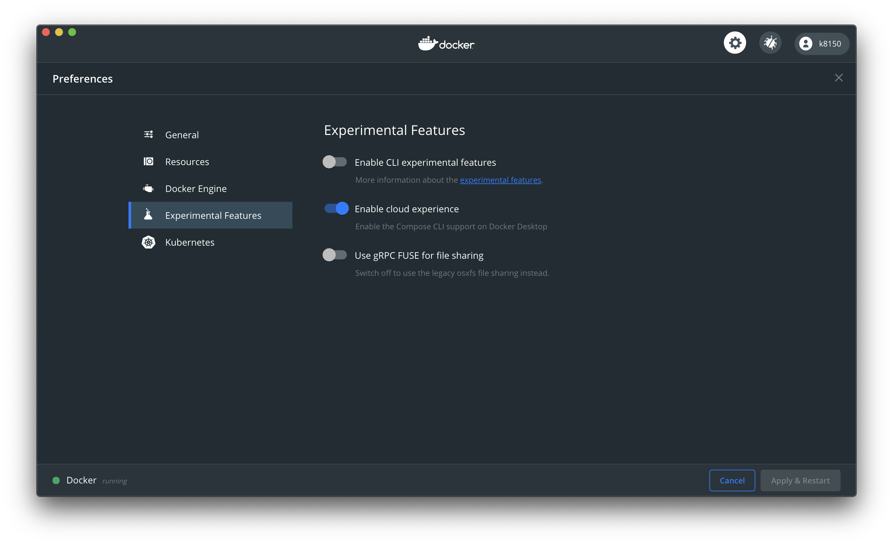

## 事象

Docker3.0.0にアップデートを行った後、`docker-compose up -d`をすると下記エラーが発生し、起動に失敗するようになった。
対象ディレクトリのマウントに失敗している。

```log
❯ docker-compose up -d
docker-files_db_1 is up-to-date
Starting docker-files_web_1 ... error

ERROR: for docker-files_web_1  Cannot start service web: Mounts denied: approving /Users/haigokoji/Documents/dev/RubyOnRails/udemy/docker-files: file does not exist

ERROR: for web  Cannot start service web: Mounts denied: approving /Users/haigokoji/Documents/dev/RubyOnRails/udemy/docker-files: file does not exist
ERROR: Encountered errors while bringing up the project.
```

## 対処

[docker/for-mac](https://github.com/docker/for-mac)のIssuesに同様事象が上がっていた。

https://github.com/docker/for-mac/issues/5115

Dockerデスクトップの設定から`Use gRPC FUSE for file sharing`をオフにする。



- 参考にしたコメント
https://github.com/docker/for-mac/issues/5115#issuecomment-743091322

今後アップデートで修正されるだろう。